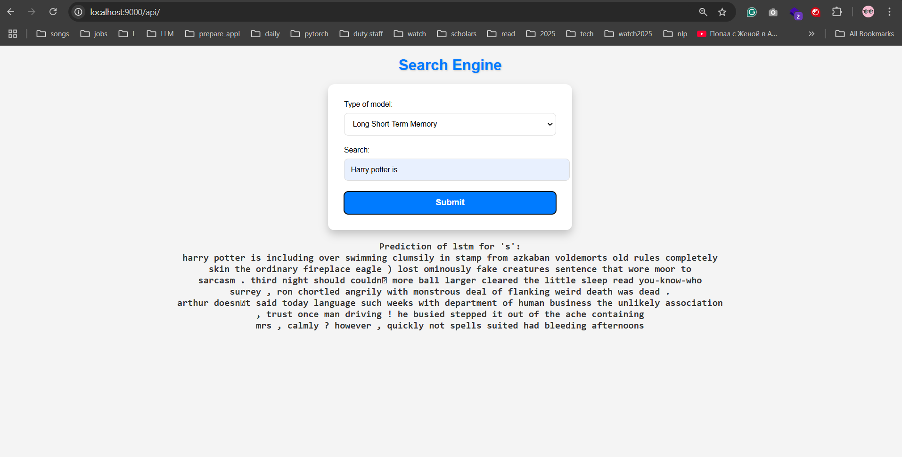

# NLP Model Deployment with FastAPI

## Important remarks
1. LSTM model size is huge to upload to github, therefore, if you want to recreate the web-app download from the following [link](https://drive.google.com/file/d/1DItqFNjpC4Fl3lt8bocwl6vGCTlHzaoq/view?usp=sharing) and make sure to put it into directory 'app/model_files'
1. Example of inference: 
2. Dataset Description: Harry Potter LSTM Dataset

   **Dataset Name:** Harry Potter LSTM Dataset  
   **Source:** [Hugging Face Datasets](https://huggingface.co/datasets/KaungHtetCho/Harry_Potter_LSTM)  
   **Creator:** Kaung Htet Cho  

   #### Description
   The Harry Potter LSTM dataset is a text dataset derived from the Harry Potter book series. It consists of unstructured text data prepared for natural language processing (NLP) tasks, specifically language modeling. This dataset is designed for sequence-to-sequence learning and is commonly used to train models such as LSTMs and Transformers to generate text in the style of the Harry Potter universe.

   #### Purpose
   The dataset is suitable for various NLP tasks, including:
   - Text generation
   - Language modeling
   - Sequence-to-sequence learning

   #### Source Attribution
   The dataset is hosted on the Hugging Face Datasets platform and was created by Kaung Htet Cho. Proper credit has been provided to the dataset's source and creator.

   #### License
   Refer to the [Hugging Face page](https://huggingface.co/datasets/KaungHtetCho/Harry_Potter_LSTM) for licensing details.

3. Steps for Preprocessing Text Data

   1. **Dataset Loading**  
      The dataset was loaded using the Hugging Face `datasets` library to ensure ease of access and compatibility with NLP frameworks.

   2. **Text Tokenization**  
      A `basic_english` tokenizer was used to split text into lowercased word tokens, removing punctuation and unnecessary formatting.

   3. **Removing Empty Text Entries**  
      Entries with empty or whitespace-only `text` fields were filtered out to retain only meaningful text data.

   4. **Tokenizing the Dataset**  
      Each text entry was tokenized to create a list of tokens, preparing the dataset for language modeling tasks.

   5. **Removing Empty Token Lists**  
      Any entries that resulted in empty token lists after tokenization were filtered out to ensure a clean dataset.

   6. **Building the Vocabulary**  
      A vocabulary was built from the tokenized dataset with a minimum frequency threshold. Special tokens such as `<unk>` and `<eos>` were added to handle unknown words and mark the end of sentences.

   7. **Setting Default Index for Unknown Tokens**  
      The `<unk>` token was set as the default index to handle out-of-vocabulary words during model training.

4. Model Architecture

   The model used for training is an **LSTM-based Language Model** designed to predict the next word in a sequence. Below are the key components of the architecture:

   1. **Embedding Layer**  
      - Converts input tokens (word indices) into dense vector representations of a fixed size (`emb_dim`).
      - Initialized uniformly within a small range to ensure stable training.

   2. **LSTM Layers**  
      - A multi-layer Long Short-Term Memory (LSTM) network with `num_layers` layers and a hidden dimension of `hid_dim`.
      - Incorporates dropout regularization (`dropout_rate`) to reduce overfitting.
      - Processes the sequential input and learns temporal dependencies in the data.

   3. **Dropout Layer**  
      - Adds dropout after the embedding and LSTM layers to further regularize the model and improve generalization.

   4. **Fully Connected Layer**  
      - Maps the output of the LSTM to the vocabulary size (`vocab_size`) to produce logits for each token in the vocabulary.
      - The weights and biases are initialized with uniform distribution for better convergence.

   5. **Initialization**  
      - Custom initialization of weights for the embedding, fully connected, and LSTM layers to ensure stable and efficient training.

   6. **Hidden State Management**  
      - The `init_hidden` method initializes the LSTM's hidden and cell states with zeros.
      - The `detach_hidden` method detaches hidden states from the computation graph during training to prevent backpropagation through time from exceeding the current batch.

## Project Overview
This project demonstrates a complete pipeline for training and deploying NLP models from scratch using modern tools and frameworks. It involves building foundational NLP models, setting up a scalable FastAPI-based deployment service, and offering predictive capabilities for next-word suggestions.

## Key Features
1. **Custom Trained NLP Models**:
   - Implemented and trained **Skip-gram** models (with and without Negative Sampling) and **GloVe** from scratch for word vector representations.
   - Models are designed to capture semantic and syntactic relationships between words effectively.

2. **FastAPI Service for Model Deployment**:
   - A robust and scalable **FastAPI** template is used to deploy the trained models.
   - The API serves predictions quickly and is designed for extensibility, making it easy to integrate additional models or functionalities.

3. **Next-Word Prediction**:
   - The service predicts the **next word** based on a given sequence of words, using trained embeddings.
   - The prediction process allows for **adjustable window sizes**, enabling fine-tuned control over the context used for prediction.

## How It Works
1. **Model Training**:
   - Skip-gram and GloVe models are trained on a corpus to generate embeddings that effectively represent the relationships between words.
   - Negative Sampling is optionally used in Skip-gram to improve efficiency.

2. **API Deployment**:
   - A FastAPI application exposes an endpoint where users can input a sequence of words and receive a predicted next word.
   - The model inference pipeline is optimized for fast predictions.

3. **User Interaction**:
   - Users provide a sequence of words through the API.
   - The system processes the input, retrieves word embeddings, computes similarities, and returns the most probable next word.

## API Features
- **Endpoint**: `/predict`
  - **Input**: JSON object with a sequence of words and optional configuration (e.g., window size).
  - **Output**: Top predictions for the next word, including probabilities.
  
- **Dynamic Configuration**:
  - Users can adjust the window size to specify the number of context words used for predictions.

## Prerequisites
- Python 3.9 or higher
- FastAPI and related dependencies
- Trained NLP models (Skip-gram/GloVe)

## How to Run
1. Clone the repository:
   ```bash
   git clone <repository_url>
   cd <repository_name>
   ```
2. Build&run docker container:
   ```bash
    docker compose build api_a1
    docker compose up api_a1
   ```
    or docker itself:
    ```bash
    docker build -f Dockerfile -t app .
    docker run -p 9000:9000 --rm --name app -t -i app
    ```
   or u can also use poetry and install dependencies manually:
   ```bash
    poetry install
    poetry run uvicorn app.main:app --reload --host 0.0.0.0 --port 9000
   ```

3. Access the service:
   - Visit `http://127.0.0.1:9000/docs` to explore API endpoints.

## Example Usage
- **Input**:
  ```json
  {
    "search": ["the", "quick", "brown"],
  }
  ```
- **Output**:
  ```json
  {
    "result": ["fox", "dog", "cat"]
  }
  ```

## Future Enhancements
- Add support for additional NLP models.
- Extend functionality to include sentence generation or text completion.
- Implement model optimization techniques for faster inference.
